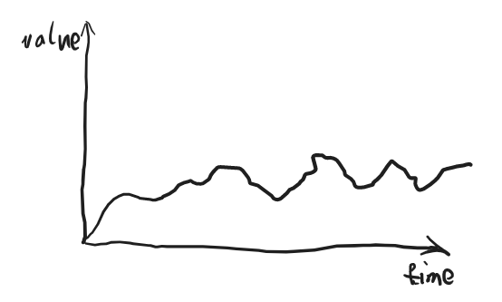
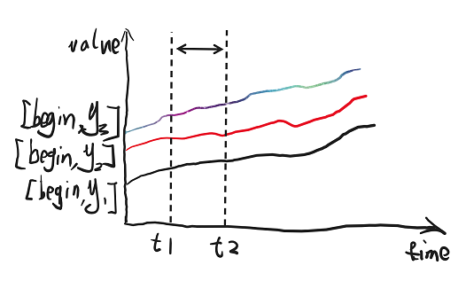
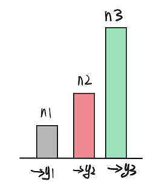
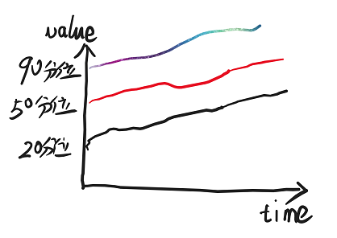

## 14 日志和监控

软件开发过程中，将一个需求以代码的形式实现，并且部署到线上，并不代表当前需求的开发周期完成了。首先我们无法保证这次交付的代码是没有逻辑缺陷；其次我们无法保证当前的代码能够高效运行，能够抗住高并发的冲击。对于前者，我们需要能在用户反馈软件的使用障碍的时候，能够方便找到他们使用过程中产生的现场数据，方便定位问题；对于后者我们需要将软件运行过程的性能指标数据收集起来，在指标数据超过设定阈值的时候能够立马采取人工干预，做扩容操作。

解决上述这两方面的问题，我们就需要软件运行过程中收集日志和监控指标。日志，确切的说是访问日志，在服务器每次被请求的时候，将请求的参数和响应字段做记录；监控指标，可以收集服务的运行响应时间、请求频率、内存损耗等信息。从上述分析中可以看出，日志和监控指标的内容是有重合的部分的，详细日志中也可以记录响应时间，也可以推算除请求频率。但是监控指标不会讲所有明细数据都采集，而是在固定时间间隔内采集一次，用这些采集到的离散的点来从逻辑上描述一个趋势，以此来预感服务是否正常，不正常则报警。所以说监控指标采集的数据量更小，日志数据收集的更精细，力求涵盖单次请求的所有上下文数据。两者各有所长，在不同的场景下发挥其作用。

### 14.1 收集日志

日志收集还是比较容易实现的，拿使用 Express 的情况做一个介绍，在其中添加一个中间件，然后把请求头信息、请求参数、响应码、响应正文等数据收集起来，可以发送到消息队列然后转存到日志分析服务中，或者可以直接发送到数据库中。

> 可以参考笔者的项目 [@yunnysunny/request-logging](https://github.com/yunnysunny/request-log) 。

### 14.2 采集监控指标

对于监控指标的采集，一般采用的是 [Prometheus](https://prometheus.io/) ，它需要定时请求应用程序自己提供 HTTP 接口来拉取监控指标数据。

> 这种行为跟传统的监控服务的 zabbix 正好相反（zabbix 需要依赖应用程序主动将监控指标上报上去），但是这种主动拉取的行为更具有灵活性，这样可以在 Prometheus 侧统一控制数据抓取时间间隔，还可以通过感知应用侧的 HTTP 接口是否可用来触发预警。

所以如果想让 Prometheus 正确的抓取到数据，必须使用它的驱动程序生成符合 Prometheus 读取格式的数据，这个驱动就是 [prom-client](https://github.com/siimon/prom-client) 。要想学习这个驱动的使用方法，必须先了解 Prometheus 中的数据结构。

#### 14.2.1 指标数据结构

##### 14.2.1.1 计数器 （Counter）

计数器随着时间的增加，只能增加不能减少，从数学意义上讲其值和时间的关系是一个线性的递增的曲线。

**图 14.2.1.1.1**

##### 14.2.1.2 仪表盘（Guage）

仪表盘可以理解为汽车的速度表，其取值随着时间的推移可以忽高忽低，从数学意义上讲其值和时间的关系是一个不规律的曲线。从理论上也可以出现负值，这主要取决于指标采集者采集的数据的具体内容，比如说采集的数据是摄氏度，就有可能出现负值的情况。

**图 14.2.1.2.1**

##### 14.2.1.3 直方图（Histogram）

直方图是一种统计学上的数据结构，它一般用来将一个固定取值空间内的数据划分为若干区间，这里提到的“区间”，在 Prometheus 中被称之为桶（bucket）。应用程序在生成指标数据的时候，需要在每个桶里填入落入当前桶所关联的取值区间的总数。和前两小节讲到的数据结构不同，计数器和仪表盘在一个时间点上取到的是一个值，而直方图会取到个值，每个桶都会对应一个值。同时注意到各个桶的取值范围都是 `[begin, y]`，其中 `begin` 为取值空间的最小值，`y` 取值空间中的一个具体取值，如果有三个数值满足 `y3 > y2 > y1`，则很明显桶 `[begin, y3]` 包含 `[begin, y2]`，桶 `[begin, y2]` 包含 `[begin, y1]`。

**图 14.2.1.3.1**

借助于第三方可视化工具，我们可以会截取一个时间段，将其绘制成我们更直观看到的直方图，比如说我们我们在上图中截取一个虚线指示的时间段。

**图 14.2.1.3.2**

就可以转化成一个如下的可视化结构

**图 14.2.1.3.3**

由于展示的是一个时间段内的取值，所以上图中 n1 n2 n3 代表三个不同的桶在当前时间段内的平均值。由于 y3 y2 y1 三个桶是互相包含的关系，所以一定会保持这个关系 `n3 >= n2 >= n1`。

##### 14.2.1.4 摘要（Summary）

摘要和直方图类似，都是对于数据划分不同的统计区间，只不过摘要的桶是按照百分位数划分的。百分位数是一个统计学术语， 需要通过一个例子来解释其含义。假设一个年级有 100 位学生，我们将学生的分数按照从小到大排列形成一个数组（这里假定没有同分现象），则数组第 95 位对应的学生的分数就叫做 95 分位数，我们记这个分数为 `α`，则代表该年级 95% 的学生的学生分数都低于或者等于 `α` 。

由于我们在采集样本的时候，样本数目肯定不会恰好等于 100 个，所以在计算百分位数的时候，会有一定误差，所以 Prometheus 的各个语言的 API 在初始化摘要的时候，都会设定一个误差允许范围。同时留意到，和直方图不同的是摘要的计算是发生在客户端。但是如果你的程序是分布式的，将多个机器上的计算的同一指标的摘要是没法做加和运算的，但是同一指标的直方图数据却是可以加和的。

同直方图类似，百分位数大的桶是包含百分位小的桶的样本的，但是直方图录入  Prometheus 落入某一个桶的总数，而摘要代表的是落入当前桶里面的所有样本的最大值。假设我们将一个服务的各个接口的处理时长做成摘要录入 Prometheus ，则 95 分位的值代表所有时长正序排序后前 95% 的样本中的最大值。

将摘要的各个桶绘制出来时间曲线的话，跟直方图也是类似的形状：

**图 14.2.1.4.1**

